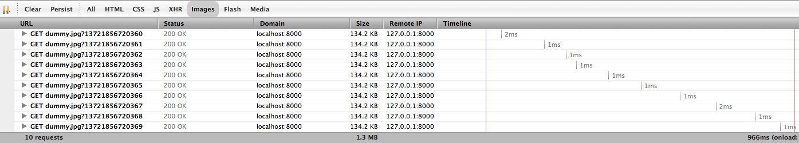
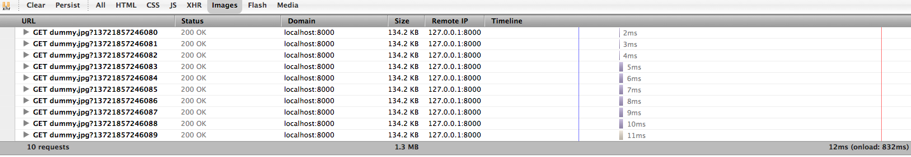

pre-loader
==========

Event-driven sequential image preloading in vanilla js.

## Installing

Either [download](https://github.com/DimitarChristoff/pre-loader/releases) it

...or, clone the repo:
```sh
$ git clone https://github.com/DimitarChristoff/pre-loader.git
...
$ cd pre-loader
```

...or use bower:

```sh
$ bower install pre-loader --save
```

## Basic use

Load an array, get a functional callback when done:

```javascript
// under a normal browser
new preLoader(/*Array*/images, /*Object*/options/);

// AMD with requireJS
require(['../js/pre-loader'], function(preLoader){
	new preLoader(/*Array*/images, /*Object*/options/);
});
```

_NOTE: if RequireJS or any other AMD-compatible loader is available, pre-loader will not go to the global object but define
itself as an AMD module that can be required._


## Options

The `options` object you can pass to the constructor supports 5 different keys.

```
{
	// use a single pipeline, default: false
	pipeline: false,
	// auto start loading when instantiated
	auto: true,
	// optional function to call on each image
	onProgress: function(src, imageEl, index){},
	// optional function to call when all done
	onComplete: function(loaded, errors){},
	// optional function to call when an error happens
	onError: function(src){}
};
```

## Example

The most basic example to prime the cache with 2 images:

```javascript
new preLoader(['image1.jpg', 'http://domain.com/image2.jpg'], {
	onComplete: function(loaded, errors){
		console.log('cache primed with:', loaded);
		errors && errros.length && console.log('these failed:', errors);
	}
});
```

## Progress reporting

Loading an array of images, firing a callback with each one and in the end:

```javascript
new preLoader(['image1.jpg', 'http://domain.com/image2.jpg'], {
	onProgress: function(src, element, index){
		if (element){
			console.log|('loaded ' + src);
			// gets optional reference to element you can use:
			// document.appendChild(element);
		}
		else {
			console.log('failed ' + src);
		}

		// output some stats
		var donePercent = Math.floor((100 / this.queue.length) * this.completed.length);
		console.log(donePercent + '% completed', this.completed.length + this.errors.length + ' / ' + this.queue.length + ' done');
	},
	onComplete: function(loaded, errors){
		console.log('cache primed with:', loaded);
		errors && errros.length && console.log('these failed:', errors);
	}
});
```

## Pipeline vs parallel

Optionally, you can control how the loading takes place. You can either let the browser resolve the resource handling or you could stick to using a single thread with pipelining (each image that completes calls the next one in the stack).

```javascript
new preLoader(['image1.jpg', 'http://domain.com/image2.jpg'], {
	// enable a single pipeline
	pipeline: true,
	onComplete: function(list, errors){
		// this will take longer but won't waste resources.
	}
});
```

Waterfall with pipeline enabled:


Waterfall with parallel downloading enabled:



For more info, see the `example` folder or look at [http://jsfiddle.net/dimitar/mFQm6/](http://jsfiddle.net/dimitar/mFQm6/)
